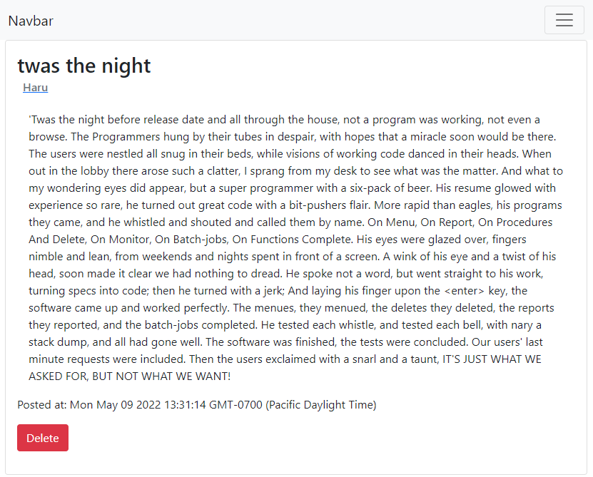

# mvc-tech-blog
a small tech blog site made using handlebars.js view controller

## Introduction

This is small blogging/commenting website similar to reddit where users can post
 text and then comment on said text.

The back end is a mysql database, accessed through node.js

## Installation

You can access it online however it is also possible to run it locally to see 
how it functions. This will require node.js to be installed
as well as mysql

Download the repository to a directory and run `npm install` within it.

After the install completes create a `.env` file in the root directory. The file
should have three variables. 

```
DB_NAME=forum_db
DB_USER=<<Username that has access>>
DB_PASSWORD=<<your password>>
```

Optionally you can seed the database with some dummy posts and comments by 
running `npm run seed`

## Usage 

Deployed to: https://tranquil-eyrie-00353.herokuapp.com/

When you go to the port it is served at (3001 by default) you will be allowed to
create a user by clicking on login. 


Once you create a user you are able to create posts by going to the homepage 
and entering information into the form


You can see all posts by clicking on the posts link in the navbar.

Each post has its own page where you can add a comment to that post. 

Additionally if that post is one you personally made you can delete it. 



## Technologies used

   

The rendering engine used for this was [handlebars](https://handlebarsjs.com/)

## Credits

Technology badges from: https://github.com/Ileriayo/markdown-badges
License badge from: https://gist.github.com/lukas-h/2a5d00690736b4c3a7ba

## License 
[](https://opensource.org/licenses/MIT)